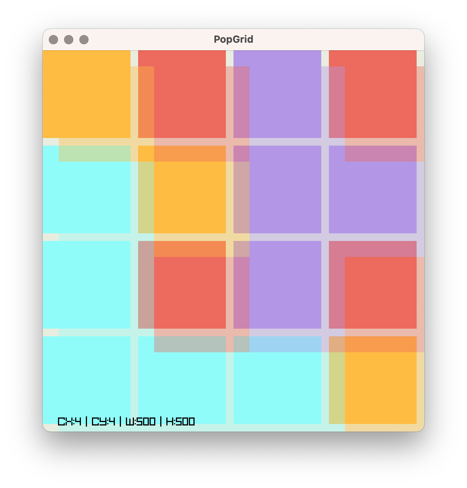

# Generative Art Experiment with Odin and Raylib

The code is a small experiment to get started with Odin. It uses Raylib to create a Pop Art inspired color grid with different opacities that changes after specific time.

A settings dialog is provided using Raylib GUI to change some aspects like the number of tiles and change frequency.

[](popgrid.mp4)

<video src="https://github.com/pteich/popgrid/raw/main/popgrid.mp4"></video>

## Run

You need a working Odin toolchain from https://odin-lang.org.

After this just use:
```bash
odin run ./src -out:popgrid
```

This compiles to a binary called popgrid and executes it.

## Controls

Press <space> or left mouse button to start from the menu. In normal mode, press <space> to access the settings screen.

## Credits

Original idea by https://codeberg.org/proto-0/raylib_experiments/src/branch/main/pop_grid